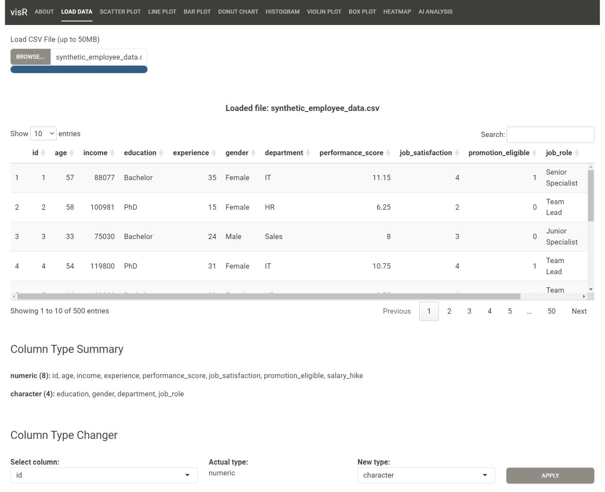
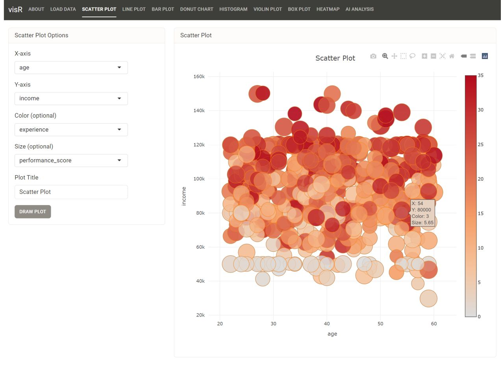
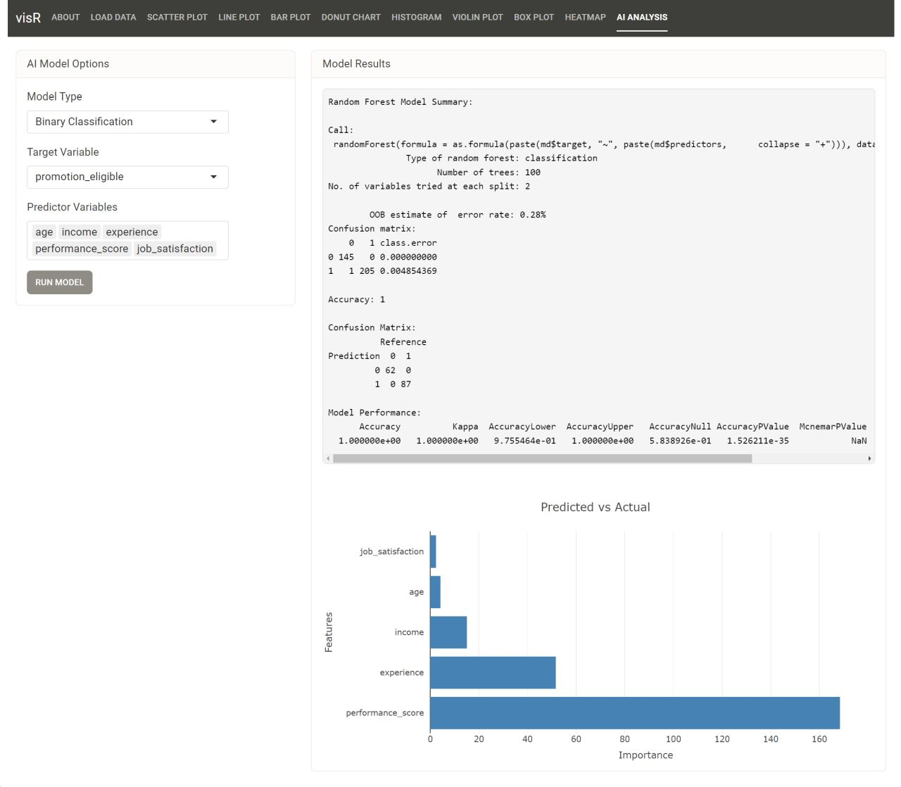

# visR: Interactive Data Visualization Tool

visR is a comprehensive R Shiny package designed for interactive data visualization and basic AI model analysis. It provides a user-friendly interface for exploring and visualizing data through various chart types and running simple machine learning models.  

<div align="center">



</div>
<br>

> **Note:** "The visR_dashboard.R file is created using the `shinydashboard` package, which gives it a distinct appearance. It functions as a standalone application but does not support keyword arguments."  

<p>Video: <a href="https://youtu.be/edaPRQnzyUg">https://youtu.be/edaPRQnzyUg</a></p>

## Table of Contents
1. [Features](#features)
2. [Installation](#installation)
3. [Usage](#usage)
4. [Detailed Functionality](#detailed-functionality)
5. [Customization](#customization)
6. [Dependencies](#dependencies)
7. [Contributing](#contributing)
8. [License](#license)

## 1. Features

- **Data Loading:** Upload CSV files or use pre-loaded datasets.
- **Data Exploration:** View and modify data types of columns.
- **Visualization Types:**
  - Scatter Plots: Visualize relationships between two numerical variables.
  - Line Plots: Display trends over time or another continuous variable.
  - Bar Charts: Compare categorical data.
  - Donut Charts: Show composition of a whole.
  - Histograms: Visualize distribution of a single numerical variable.
  - Violin Plots: Display probability density of the data at different values.
  - Box Plots: Show distribution of numerical data and identify outliers.
  - Heatmaps: Visualize complex data through color-coding.
- **AI Analysis:** Run basic machine learning models:
  - Binary Classification: Predict one of two possible outcomes.
  - Multi-Class Classification: Categorize data into multiple classes.
  - Linear Regression: Predict a continuous outcome variable.
- **Interactive Plots:** All visualizations are interactive, allowing for zooming, panning, and hovering for more information.
- **Customization:** Adjust plot titles, axis labels, and other parameters.

## 2. Installation

To install and run visR, you need R and the visR package.  
After installation, you can load the visR library and call the visR function as shown in the usage examples.

## 3. Usage

To use visR, you can either run it with default settings or customize it with parameters:

```R
# Load the visR package
library(visR)

# Run with default settings
visR()

# Run with a specific CSV file
visR(csv = "path/to/your/data.csv")

# Run with specific chart types
visR(chart = "scatter,line,bar")

# Run with both CSV and chart types
visR(csv = "path/to/your/data.csv", chart = "scatter,line,bar")
```

## 4. Detailed Functionality

### 4.1 Data Loading and Exploration
Users can upload CSV files or use pre-loaded datasets. The app provides a data table view where users can explore their data and modify column types if necessary.

### 4.2 Visualization Types
Each visualization type has its own tab with customization options:
- **Scatter Plots:** Choose X and Y variables, optional color and size variables.
- **Line Plots:** Select X and Y variables for trend visualization.
- **Bar Charts:** Pick categorical and numerical variables for comparison.
- **Donut Charts:** Select a categorical variable to show composition.
- **Histograms:** Choose a numerical variable and adjust bin count.
- **Violin Plots:** Select categorical and numerical variables for distribution comparison.
- **Box Plots:** Pick categorical and numerical variables for distribution and outlier visualization.
- **Heatmaps:** Choose X, Y, and Z variables for color-coded visualization.

### 4.3 AI Analysis
The AI tab allows users to run basic machine learning models:
- **Binary Classification:** Predict one of two possible outcomes.
- **Multi-Class Classification:** Categorize data into multiple classes.
- **Linear Regression:** Predict a continuous outcome variable.

Users can select the target variable and predictor variables. The app will split the data into training and testing sets, train the model, and display performance metrics and visualizations.

## 5. Customization

visR allows for various customizations:
- Plot titles can be adjusted for each visualization.
- Axis labels are automatically set based on selected variables but can be modified.
- Color schemes are preset but can be adjusted in the code for advanced users.
- The UI theme can be modified by changing the `bs_theme` parameters in the code.

## 6. Dependencies

visR relies on the following R packages:
- `shiny` and `shinydashboard` for the web application framework
- `plotly` for interactive plots
- `dplyr` for data manipulation
- `readr` for reading CSV files
- `DT` for interactive data tables
- `caret` and `randomForest` for machine learning models
- `bslib` for Bootstrap themes

## 7. Contributing

Contributions to visR are welcome! Here are ways you can contribute:
- Reporting bugs
- Suggesting enhancements
- Writing or improving documentation
- Submitting pull requests with bug fixes or new features

Please feel free to submit issues and pull requests on our GitHub repository.

## 8. License

This project is open source and available under the [MIT License](https://opensource.org/licenses/MIT).

> **Note:** This README provides a detailed overview of the visR application. For the most up-to-date information and usage instructions, please refer to the in-app documentation and tooltips.

---

Created with ❤️ by the visR team <a href="https://github.com/accaderi/visR-Interactive-Data-Visualization-Tool">GitHub</a>